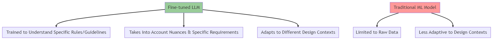
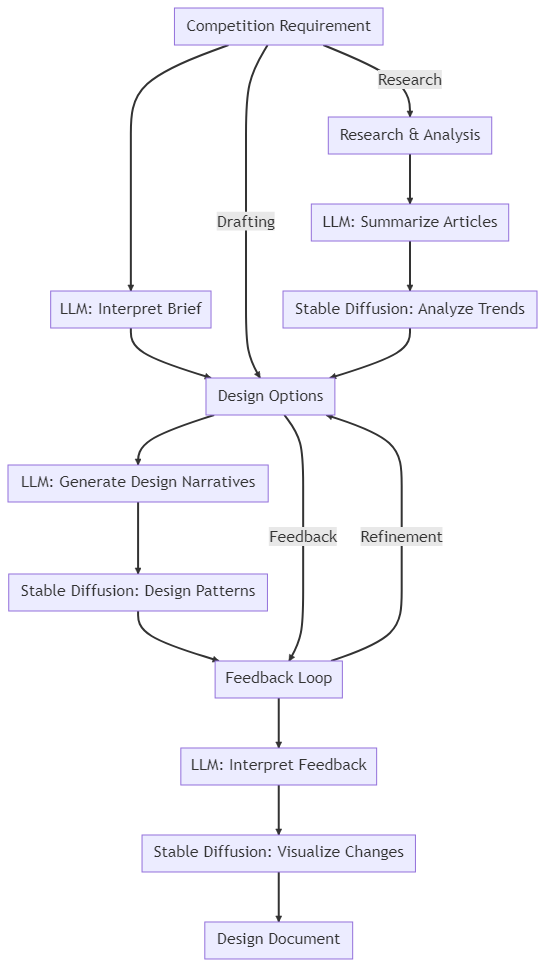
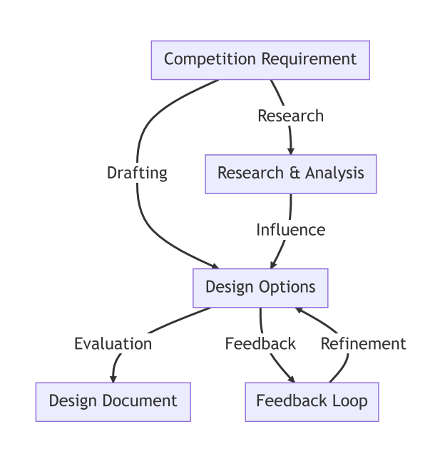
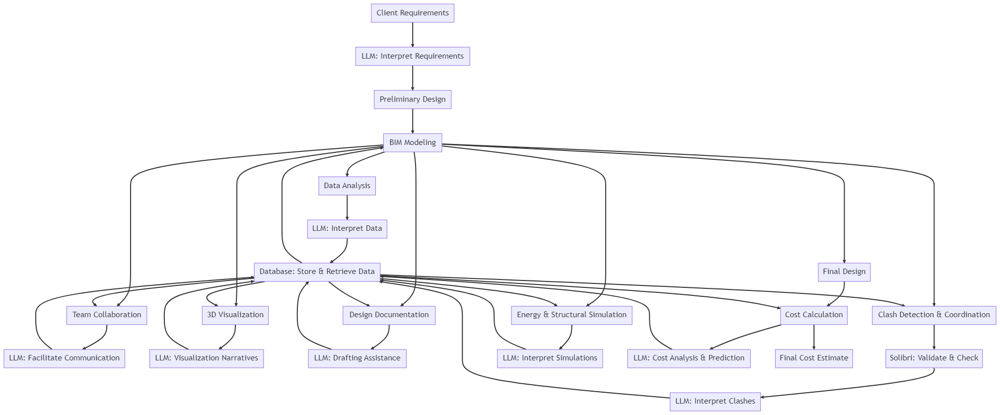

# How Large Language Models (LLM) Can Revolutionize Architectural Design and BIM Processes

In the realm of architectural design and building information modeling (BIM), the integration of advanced technologies can significantly enhance the accuracy and efficiency of various processes. One such promising technology is the Large Language Model (LLM), which has shown potential in outperforming traditional machine learning models in certain tasks. This article delves into how LLMs can improve the data processes of architectural offices, from the competition phase to data management.

## LLM vs. Traditional Machine Learning

Traditional machine learning models primarily rely on raw data and might be less adaptive to different design contexts. In contrast, a fine-tuned LLM:
- Can be trained to understand specific rules or guidelines provided by the user.
- Takes into account not just the raw data but also the nuances and specific requirements of each project.
- Adapts to different design contexts more effectively.

## Enhancing the Competition Phase with LLM

 

The competition phase in architectural design can benefit immensely from LLMs. By leveraging past project data, LLMs can:
- Assist in drafting competition requirements.
- Generate multiple design options based on the requirements.
- Evaluate the designs and provide feedback.
- Predict optimal design parameters for elements like doors and windows.

## Improving BIM Processes with LLM

Building Information Modeling (BIM) is a crucial aspect of modern architectural design. Integrating LLMs into the BIM process can lead to:
- Enhanced coordination among different stakeholders.
- Improved cost calculation and prediction.
- Efficient data management and extraction from tools like Revit.
- Quick processing of large sets of simulation results.
- Comprehensive report generation based on simulation outcomes.
- Accurate predictions of potential outcomes of design changes.

## Conclusion

The integration of Large Language Models into architectural design and BIM processes holds immense promise. By understanding specific rules, considering nuanced requirements, and adapting to various design contexts, LLMs can offer enhanced accuracy and efficiency compared to traditional machine learning models. As architectural firms continue to embrace advanced technologies, LLMs are poised to play a pivotal role in shaping the future of design and construction.
